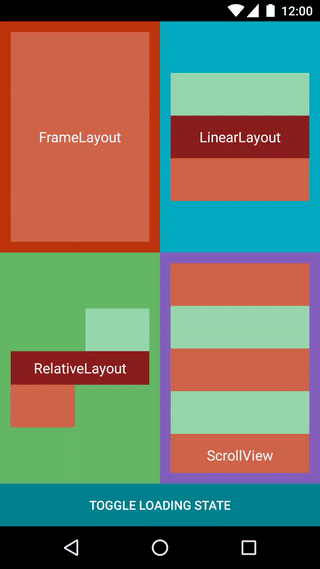

# Progress Layouts

An Android library which provides a collection of the most common layouts, extended with the capability of easily switching to a loading state, in which the content is hidden and a loading indicator is displayed in the center of the view.



Requires API level 16 or higher.

## Features

- Easy-to-control loading state for FrameLayout, LinearLayout, RelativeLayout and ScrollView
- Material Design circular indeterminate progress indicator as the default loading indicator
- Color and color scheme customization for the default loading indicator
- Custom drawable as the loading indicator
- Optional message beneath the loading indicator

## Setup

Add the following dependency to your `build.gradle` file:

```groovy
dependencies {
    compile 'net.mready.progresslayouts:progresslayouts:1.1.0'
}
```

## Usage

The library provides the following layouts:

- ProgressFrameLayout
- ProgressLinearLayout
- ProgressRelativeLayout
- ProgressScrollView

Use these layouts exactly like you would do it with their corresponding system ViewGroups.

### Basic usage

The simplest way to use a ProgressLayout is to declare it in your XML layout file, get a reference to it in your code, and then call `setLoading(boolean)`.

```xml
<net.mready.progresslayouts.ProgressFrameLayout
    android:id="@+id/progressLayout"
    android:layout_width="match_parent"
    android:layout_height="match_parent" />
```

```
ProgressLayout progressLayout = (ProgressLayout) findViewById(R.id.progressLayout);
progressLayout.setLoading(true);
```

This will hide all the child views of the ViewGroup and display a loading indicator in the center of the ViewGroup until you call `setLoading(false)`.

If you are using data binding in your project, there's even a simpler way to use the layouts:

```xml
<net.mready.progresslayouts.ProgressFrameLayout
    android:layout_width="match_parent"
    android:layout_height="match_parent"
    app:loading="@{viewModel.loading}" />
```

### Customization

#### Default loading indicator color

By default, the loading indicator will use the Material Design circular indeterminate progress indicator, set up with the `colorAccent` used by your application. If no `colorAccent` is found, the loading indicator will use `Color.BLUE`.

A custom color or a color scheme (an array of colors) can be applied to the default loading indicator. When setting a color scheme, the indicator will animate through each of the provided colors.

```java
progressLayout.setLoadingIndicatorColorRes(R.color.indicator);
progressLayout.setLoadingIndicatorColorResScheme(R.array.indicator_colors);
```

These settings can also be applied directly inside the XML layout file:
```xml
app:loadingIndicatorColor="@color/indicator"
app:loadingIndicatorColorScheme="@array/indicatorColors"
```

#### Custom loading indicator

A custom drawable can be used to replace the default loading indicator:

```java
progressLayout.setLoadingIndicatorDrawable(R.drawable.indicator);
```

Or, using XML attributes:

```xml
app:loadingIndicatorDrawable="@drawable/indicator"
```

#### Loading message

You can also add a text message below the loading indicator:

```java
progressLayout.setLoadingText("Please wait");
```

Or, using XML attributes:

```xml
app:loadingText="Please wait"
```

The text can be stylized using a text appearance:

```java
progressLayout.setLoadingTextAppearance(R.style.AppTheme_Text_Loader);
```

Or, using XML attributes:

```xml
app:loadingTextAppearance="@style/AppTheme.Text.Loader"
```

#### Theme-wide customization

You can set a theme-wide style for all the progress layouts:

```xml
<style name="AppTheme" parent="Theme.AppCompat">
    <item name="progressLayoutStyle">@style/AppTheme.ProgressLayout</item>
</style>

<style name="AppTheme.ProgressLayout">
    <!-- customize your progress layout here -->
    <item name="loadingIndicatorDrawable">@drawable/loader</item>
</style>
```

## Limitations

At the moment, these layouts are only useful for indeterminate loading indicators. Future versions might include a way to set a progress value and to use a determinate loading indicator.

## Dependencies

This library uses Facebook's [TextLayoutBuilder](https://github.com/facebookincubator/TextLayoutBuilder) for building and displaying the loading message.

## License

```
Copyright 2017 mReady

Licensed under the Apache License, Version 2.0 (the "License");
you may not use this file except in compliance with the License.
You may obtain a copy of the License at

   http://www.apache.org/licenses/LICENSE-2.0

Unless required by applicable law or agreed to in writing, software
distributed under the License is distributed on an "AS IS" BASIS,
WITHOUT WARRANTIES OR CONDITIONS OF ANY KIND, either express or implied.
See the License for the specific language governing permissions and
limitations under the License.
```